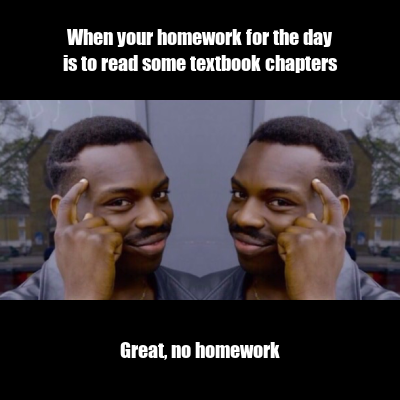

# Stats 220 Assignment 1

**This is how the finished product looks like**



## Meme explanation


*The following code was used to create the above meme*

```r
library(magick)

#Loading image and scaling it down
meme_image_left <- image_read("https://memegenerator.net/img/images/16836360.jpg")%>%
  image_scale(400) %>%
    image_crop("200x200")

meme_image_right <- image_read("https://memegenerator.net/img/images/16836360.jpg")%>%
  image_scale(400) %>%
    image_crop("200x200") %>%
      image_flop()

#Picture section
#Appending two pictures so they align horizontally
am <- c(meme_image_left, meme_image_right)
fm <- image_append(am)


top_text <- "When your homework for the day\nis to read some textbook chapters"

#Create top text section
top_text_background <- image_blank(width = 400,
                                   height = 100,
                                   color = "black") %>%
  image_annotate(text = top_text,
                 color = "white",
                 size = 20,
                 font = "Impact",
                 gravity = "center")

#Create bottom text section
bottom_text_background <- image_blank(width = 400,
                                   height = 100,
                                   color = "black") %>%
  image_annotate(text = "Great, no homework",
                 color = "white",
                 size = 20,
                 font = "Impact",
                 gravity = "center")


#Add 3 sections together 
final_meme <- c(top_text_background, fm, bottom_text_background) %>%
  image_append(stack = TRUE)


#Saving picture as an image file
image_write(final_meme, "A1_Part1.jpg")
final_meme
```
